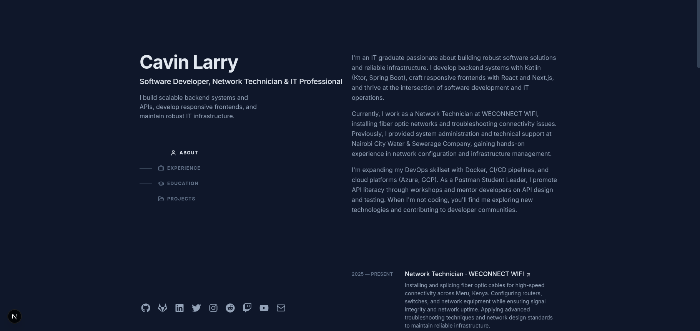

# Personal Portfolio - Cavin

A modern, responsive portfolio website built with Next.js 16, TypeScript, and Tailwind CSS v4. Showcasing my work as a Software Developer, Network Technician and IT Professional.



## Features

- **Lightning Fast** - Built with Next.js 16 for optimal performance
- **Fully Responsive** - Seamless experience across all devices
- **Modern UI/UX** - Clean design with smooth animations and transitions
- **Accessible** - WCAG compliant with semantic HTML and ARIA labels
- **SEO Optimized** - Meta tags, OpenGraph, and structured data
- **Dark Theme** - Professional dark color scheme with teal accents
- **Dynamic Content** - Easy content management through single config file
- **Type Safe** - Built with TypeScript for reliability

## Tech Stack

- **Framework:** [Next.js 16](https://nextjs.org/) (App Router)
- **Language:** [TypeScript](https://www.typescriptlang.org/)
- **Styling:** [Tailwind CSS v4](https://tailwindcss.com/)
- **Icons:** [Lucide React](https://lucide.dev/) + [React Icons](https://react-icons.github.io/react-icons/)
- **Font:** [Inter](https://rsms.me/inter/)
- **Deployment:** [Vercel](https://vercel.com/)

## Project Structure

```
portfolio/
├── app/
│   ├── layout.tsx          # Root layout with metadata
│   ├── page.tsx            # Home page
│   ├── globals.css         # Global styles (Tailwind v4)
│   ├── loading.tsx         # Loading state
│   ├── not-found.tsx       # 404 page
│   ├── sitemap.ts          # Dynamic sitemap
│   └── archive/
│       └── page.tsx        # Projects archive
├── components/
│   ├── Header.tsx          # Navigation header
│   ├── About.tsx           # About section
│   ├── Experience.tsx      # Work experience
│   ├── Education.tsx       # Education & certifications
│   ├── Projects.tsx        # Featured projects
│   └── Footer.tsx          # Footer with credits
├── data/
│   └── content.ts          # All portfolio content (single source of truth)
├── public/
│   ├── images/
│   │   └── projects/       # Project screenshots
│   ├── resume.pdf          # Downloadable resume
│   ├── og-image.png        # Social share image
│   ├── favicon.ico         # Favicon
│   └── robots.txt          # SEO robots file
└── README.md               # You are here!
```

## Getting Started

### Prerequisites

- Node.js 18.x or higher
- npm or yarn package manager

### Installation

1. **Clone the repository**
   ```bash
   git clone https://github.com/devcavin/cavin.git
   cd cavin
   ```

2. **Install dependencies**
   ```bash
   npm install
   ```

3. **Run development server**
   ```bash
   npm run dev
   ```

4. **Open in browser**
   ```
   http://localhost:3000
   ```

## Customization

### Update Your Content

All content is managed in a single file: `data/content.ts`

```typescript
// data/content.ts
export const personalInfo = {
  name: "Your Name",
  role: "Your Role",
  tagline: "Your tagline",
  email: "your.email@example.com",
  // ... etc
};
```

### Add Project Screenshots

Place your project images in `public/images/projects/`:
```
public/images/projects/
├── project1.png
├── project2.png
└── project3.png
```

### Update Resume

Replace `public/resume.pdf` with your latest resume.

### Customize Colors

Edit the color scheme in `app/globals.css`:
```css
:root {
  --slate-900: #0f172a;  /* Background */
  --teal-300: #5eead4;   /* Accent color */
  /* ... more colors */
}
```

## Build for Production

```bash
# Create optimized production build
npm run build

# Start production server
npm run start
```

## Deployment

### Deploy to Vercel (Recommended)

1. Push code to GitHub
2. Import project on [Vercel](https://vercel.com)
3. Vercel auto-detects Next.js and deploys
4. Done!

### Deploy to Netlify

1. Build the project: `npm run build`
2. Deploy the `.next` folder
3. Configure: Build command: `npm run build`, Publish directory: `.next`

### Deploy to Other Platforms

- **Cloudflare Pages:** Supports Next.js
- **Railway:** One-click Next.js deployment
- **Self-hosted:** Use `npm run start` with PM2 or Docker

## Design Inspiration

This portfolio is inspired by [Brittany Chiang's portfolio](https://brittanychiang.com/), featuring:
- Clean, minimal design
- Smooth scroll animations
- Professional typography
- Accessible navigation
- Mobile-first approach

## License

This project is licensed under the MIT License - see below for details:

```
MIT License

Copyright (c) 2024 Cavin

Permission is hereby granted, free of charge, to any person obtaining a copy
of this software and associated documentation files (the "Software"), to deal
in the Software without restriction, including without limitation the rights
to use, copy, modify, merge, publish, distribute, sublicense, and/or sell
copies of the Software, and to permit persons to whom the Software is
furnished to do so, subject to the following conditions:

The above copyright notice and this permission notice shall be included in all
copies or substantial portions of the Software.

THE SOFTWARE IS PROVIDED "AS IS", WITHOUT WARRANTY OF ANY KIND, EXPRESS OR
IMPLIED, INCLUDING BUT NOT LIMITED TO THE WARRANTIES OF MERCHANTABILITY,
FITNESS FOR A PARTICULAR PURPOSE AND NONINFRINGEMENT. IN NO EVENT SHALL THE
AUTHORS OR COPYRIGHT HOLDERS BE LIABLE FOR ANY CLAIM, DAMAGES OR OTHER
LIABILITY, WHETHER IN AN ACTION OF CONTRACT, TORT OR OTHERWISE, ARISING FROM,
OUT OF OR IN CONNECTION WITH THE SOFTWARE OR THE USE OR OTHER DEALINGS IN THE
SOFTWARE.
```

## Contributing

While this is a personal portfolio, suggestions and feedback are welcome!

1. Fork the repository
2. Create your feature branch (`git checkout -b feature/AmazingFeature`)
3. Commit your changes (`git commit -m 'Add some AmazingFeature'`)
4. Push to the branch (`git push origin feature/AmazingFeature`)
5. Open a Pull Request

## Contact

**Cavin**
- Website: [devcavin.vercel.app](https://devcavin.vercel.app)
- LinkedIn: [linkedin.com/in/cavin-larry](https://linkedin.com/in/devcavin)
- Twitter(X): [x.com/devcavin](https://x.com/devcavin)
- Email: cavinlarry001@gmail.com

## Acknowledgments

- Design inspiration: [Brittany Chiang](https://brittanychiang.com/)
- Icons: [Lucide](https://lucide.dev/) & [React Icons](https://react-icons.github.io/)
- Font: [Inter by Rasmus Andersson](https://rsms.me/inter/)
- Framework: [Next.js by Vercel](https://nextjs.org/)
- Styling: [Tailwind CSS](https://tailwindcss.com/)

---

⭐ **Star this repo if you found it helpful!**

Built with ❤️ by [Cavin](https://github.com/devcavin)